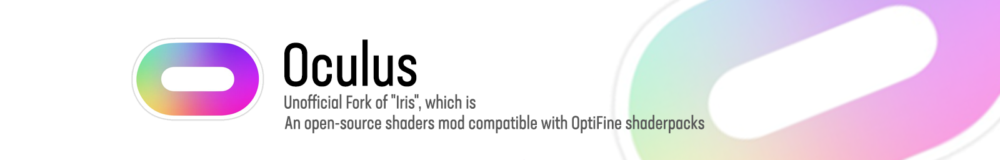

  

# NeOculus

NeOculus is an Unofficial Fork of ["Oculus"](https://www.curseforge.com/minecraft/mc-mods/oculus)

Oculus is an Unofficial Fork of ["Iris"](https://www.curseforge.com/minecraft/mc-mods/irisshaders), made to work with Forge Mod Loader.

[//]: # (## Disclaimer)

[//]: # (Oculus is not and never will be compatible with Optifine!)

## Dependencies
Oculus requires [Embeddium](https://www.curseforge.com/minecraft/mc-mods/embeddium) made by FiniteReality!

## Features
* Performance. Oculus should fully utilize your graphics card when paired with optimization mods like Rubidium.

* Mod compatibility. Oculus should make a best effort to be compatible with modded environments.

* Backwards compatibility. All existing ShadersMod / OptiFine shader packs should just work on Oculus, without any modifications required.

* A well-organized codebase. I'd like for working with Oculus code to be a pleasant experience overall.

[//]: # (## Discord)

[//]: # ([![]&#40;https://dcbadge.vercel.app/api/server/UCsyn5RS4s&#41;]&#40;https://discord.gg/UCsyn5RS4s&#41;)

## Contributors

## License

Oculus [LGPL-3.0 license](https://github.com/Asek3/Oculus/blob/1.16.5/LICENSE)  
Monocle [LGPL-3.0 license](https://github.com/ferriarnus/Monocle/blob/main/LICENSE.txt)  

[//]: # (## Consider supporting )

[//]: # ([![Support me on Patreon]&#40;https://img.shields.io/endpoint.svg?url=https%3A%2F%2Fshieldsio-patreon.vercel.app%2Fapi%3Fusername%3Dasek3%26type%3Dpatrons&style=for-the-badge&#41;]&#40;https://patreon.com/asek3&#41;)
